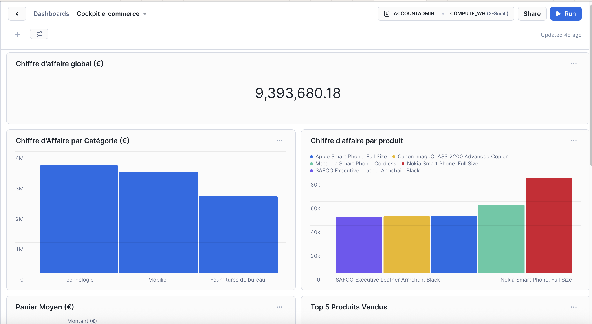

# Projet Data Engineer - Snowflake e-Commerce

Ce projet illustre la mise en place d'une base de données eCommerce complète dans un environnement **Snowflake**, en local. Il couvre l’ensemble de la chaîne de valeur Data : de la création du modèle relationnel jusqu’à l’intégration automatisée des données et la visualisation dans un dashboard.

## Objectifs pédagogiques et techniques

- Concevoir une architecture de données relationnelle adaptée au secteur eCommerce
- Implémenter une base de données dans **Snowflake** avec **SQL**
- Charger des données clients, produits et ventes manuellement et automatiquement
- Intégrer des données fournisseurs à partir de fichiers **JSON** et **XML**
- Automatiser certaines tâches avec des **scripts Python**
- Créer un **dashboard interactif** pour le suivi des ventes

## 🛠️ Stack Technique

| Outil / Langage        | Utilisation                            |
|------------------------|----------------------------------------|
| **Snowflake**          | Création et hébergement de la BDD      |
| **SQL**                | Modélisation, requêtes, transformations|
| **Python**             | Automatisation de l'import JSON/XML    |
| **JSON / XML**         | Format de données pour les fournisseurs|
| **Power BI / Tableau** | Visualisation des KPI                  |
| **Git & GitHub**       | Versioning et documentation            |
------------------------------------------------------------------
## Organisation

``` 
snowflake-ecommerce-db/
│
├── 1_database_creation/         
│   └── create_database.sql      # Script SQL pour créer la base
│
├── 2_schema_creation/           
│   └── create_schema.sql        # Création du schéma I_OPE
│
├── 3_tables_creation/           
│   └── create_tables.sql        # Script de création des 7 tables
│
├── 4_insert_data/
│   ├── insert_data.sql          # Insertion des données manuelles
│   ├── fournisseurs.json        # Données fournisseur (JSON)
│   └── fournisseurs.xml         # Données fournisseur (XML)
│
├── 5_dashboard/
│   └── dashboard.pbix           # Dashboard Power BI (ou .twb Tableau)
│
├── scripts/
│   └── ...                      # Autres scripts utiles
│
├── README.md                    # Ce fichier - documentation projet
└── requirements.txt             # Librairies Python nécessaires
``` 
------------------------------------------------------------------
## Modèle relationnel

Le projet repose sur 7 tables interconnectées :

- `TB_TYPE_CLIENT`
- `TB_CLIENT`
- `TB_CATEGORIE`
- `TB_SOUS_CATEGORIE`
- `TB_PRODUIT`
- `TB_VENTE`
- `TB_DETAIL_VENTE`

Chaque table est normalisée, avec clés primaires et étrangères pour assurer la **cohérence** et **intégrité** des données.

## ⚙️ Fonctionnalités

- Création automatisée de base, schéma et tables avec **Snowflake SQL**
- Insertion de données clients, produits, ventes et catégories
- Lecture de données externes fournisseurs (JSON/XML)
- Automatisation de l’intégration via un **script Python**
- Création d’un **dashboard BI** interactif (produits les plus vendus, CA, marge...)

## 🧪 Qualité et gouvernance

- Respect des standards relationnels (clé étrangère, types, contraintes)
- Nettoyage et contrôle de cohérence des données
- Documentation technique et projet hébergée sur GitHub
- Suivi des modifications via Git

## Pour exécuter le projet

1. Exécutez les scripts `1_database_creation/` → `4_insert_data/` dans Snowflake
2. Lancez `data_integration.py` pour charger JSON et XML
3. Ouvrez `dashboard.pbix` ou `.twb` pour visualiser les KPI

## Aperçu du Dashboard

Voici un aperçu du tableau de bord créé dans ce projet :



## 🙋‍♂️ Auteur

**Cherif Amanatoulha SY**  
Data Analyst / Data Engineer  
-------------------------------------------------------------------------------------------------------------
